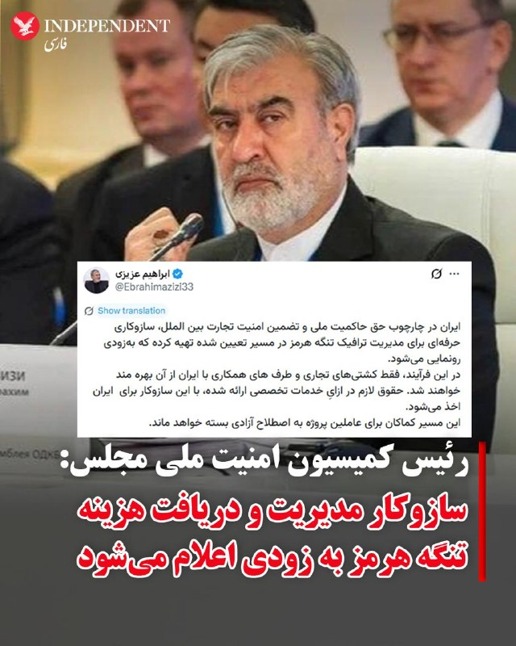
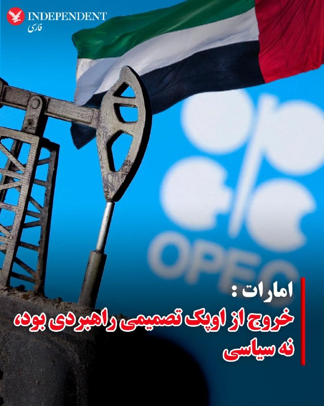
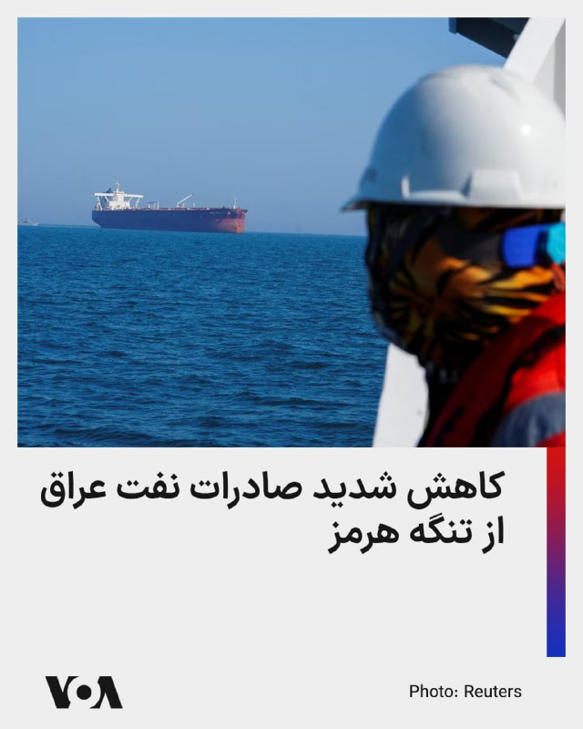
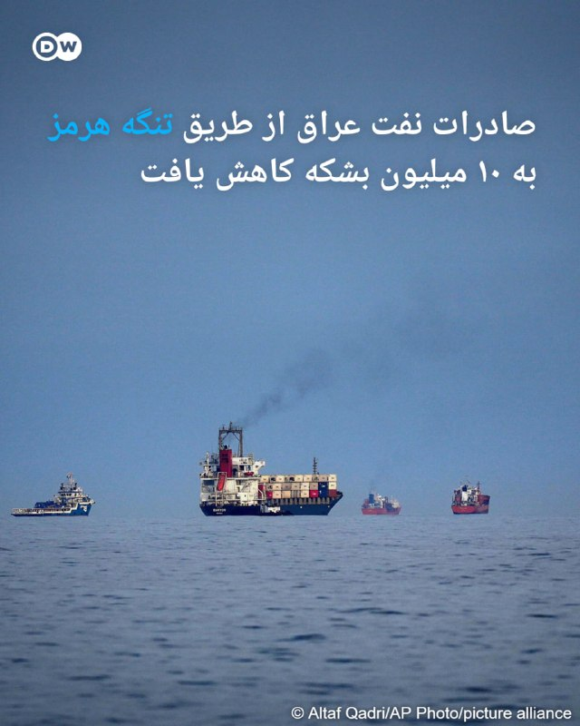
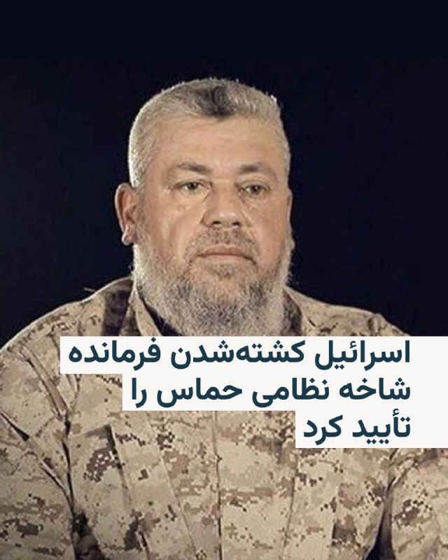

# خواننده تلگرام

<!-- TOP_NAV START -->

<a href="https://github.com/ItsyaboiParsa/aio-downloader/blob/main/telegram/content/archive_1.md" style="display:inline-block; padding:6px 12px; margin:0 4px; background-color:#2ea44f; color:white; text-decoration:none; border-radius:4px; font-weight:bold;">صفحه بعد</a>

<!-- TOP_NAV END -->

<!-- MSG START -->

---
📅 بروزرسانی: 1405/02/26 14:52
---

## VahidOOnLine — post 240460

  

⭕️ عضو شورای شهر تهران:
در جنگ اخیر، ۱۰ اثر تاریخی تهران کاملا تخریب و ۶۰ اثر دیگر آسیب دیدند

♦️سید احمد علوی، عضو شورای شهر تهران از آسیب دیدن حدود ۶۰ اثر و تخریب کامل ۱۰ اثر تاریخی پایتخت در جریان جنگ چهل روزه آمریکا و اسرائیل علیه جمهوری اسلامی خبر داد.
او گفت برنامه‌ریزی برای بازسازی بناهای تخریب‌شده با همکاری شهرداری مناطق، اداره‌کل میراث فرهنگی استان تهران و همچنین بخش خصوصی در دستور کار قرار گرفته است.
به گفته این عضو شورای شهر، بناهای تخریب‌شده قرار است با همان کاربری پیشین و در محل اصلی خود بازسازی شوند. با این حال هنوز جزئیات دقیقی از نام آثار تخریب‌شده، میزان خسارت‌ها و زمان آغاز پروژه‌های مرمت منتشر نشده است.
‌🇸🇦 Indypersian

🤖 @VahidOOnLine

## VahidOOnLine — post 240459

  

♦️ابراهیم عزیزی، رئیس کمیسیون امنیت ملی مجلس ایران، روز شنبه با انتشار پیامی در شبکه اجتماعی ایکس اعلام کرد تهران سازوکاری «حرفه‌ای» برای مدیریت تردد در تنگه هرمز از طریق یک مسیر تعیین‌شده آماده کرده است که به‌زودی جزئیات آن را اعلام می‌کند.
عزیزی در توضیح این طرح با تکرار دریافت پول در ازای گذر از تنگه هرمز نوشت: «فقط کشتی‌های تجاری و طرف‌های همکاری با ایران از آن بهره‌مند خواهند شد. حقوق لازم در ازایِ خدمات تخصصی ارائه شده، با این سازوکار برای ایران اخذ می‌شود.»
عزیزی در پایان گفت: «این مسیر کماکان برای عاملین پروژهٔ به اصطلاح آزادی بسته خواهد ماند.»
«پروژه آزادی» طرح آمریکا برای اسکورت کشتی‌ها در تنگه هرمز بود که طی آن، جمهوری اسلامی به کشتی‌ها و مناطقی در امارات متحده آتش گشود.
‌🇸🇦 Indypersian

🤖 @VahidOOnLine

## VahidOOnLine — post 240458

  <a href="telegram/content/VahidOOnLine_240458_1778930555.mp4" target="_blank">🎬 Download video</a>

کریس رایت، وزیر انرژی آمریکا گفته است انتظار دارد تنگه هرمز «حداکثر تا مقطعی در تابستان» بازگشایی شود.

رایت همچنین گفت اگر ایران به «گروگان گرفتن اقتصاد جهان» ادامه دهد، ارتش آمریکا می‌تواند برای بازگشایی تنگه هرمز مداخله کند.
‌🏁 🇬🇧 ManotoTV

🤖 @VahidOOnLine

## VahidOOnLine — post 240457

  <a href="telegram/content/VahidOOnLine_240457_1778930556.mp4" target="_blank">🎬 Download video</a>

در برنامه‌های شامگاه گذشته تلویزیون جمهوری اسلامی، بخش‌هایی با محور آموزش کار با سلاح پخش شد.

در این برنامه‌ها، مجریان یا کارشناسان حاضر در استودیو، شیوه گرفتن و استفاده از سلاح را توضیح دادند. پخش چنین محتوایی از تلویزیون حکومتی در شرایطی صورت می‌گیرد که رسانه‌های وابسته به جمهوری اسلامی در هفته‌های اخیر بر ادبیات نظامی، آمادگی دفاعی و بسیج حامیان خود تاکید بیشتری داشته‌اند.
‌🏁 🇬🇧 ManotoTV

🤖 @VahidOOnLine

## VahidOOnLine — post 240456

  <a href="telegram/content/VahidOOnLine_240456_1778930556.mp4" target="_blank">🎬 Download video</a>

‌
«دریک»، رپر، خواننده و بازیگر کانادایی، در یکی از قطعه‌های تازه خود با نام «Don’t Worry» به دختری ایرانی اشاره کرده که فارسی حرف می‌زند. این قطعه در آلبوم تازه او منتشر شده است. در متن ترانه نیز بندی آمده که در آن زن مورد اشاره خود را ایرانی معرفی می‌کند که فارسی حرف می‌‌زند.

دریک با نام کامل «آبری دریک گراهام» زاده تورنتو است و پیش از ورود جدی به موسیقی، با بازی در مجموعه تلویزیونی نوجوانانه «دگراسی، نسل بعدی» شناخته شد. او سپس به یکی از چهره‌های اصلی موسیقی هیپ‌هاپ و پاپ معاصر تبدیل شد و سبک ترکیبی او میان رپ‌خوانی و خوانندگی، جایگاه گسترده‌ای در بازار جهانی موسیقی برایش به همراه آورد.
‌🏁 🇬🇧 ManotoTV

🤖 @VahidOOnLine

## VahidOOnLine — post 240455

  <a href="telegram/content/VahidOOnLine_240455_1778930557.mp4" target="_blank">🎬 Download video</a>

ایرانیان نیوزیلند روز شنبه ۲۶ اردیبهشت‌ماه در حمایت از شاهزاده رضا پهلوی و علیه قطع اینترنت و اعدام‌های جمهوری اسلامی در اوکلند تجمع برگزار کردند.
‌🏁 🇬🇧 IranintlTV

🤖 @VahidOOnLine

## VahidOOnLine — post 240454

  

♦️فرماندهی کل نیروی دفاع بحرین، روز شنبه با انتشار بیانیه‌ای اعلام کرد تمامی یگان‌ها و تسلیحات این کشور در بالاترین سطح آمادگی و آماده‌باش دفاعی قرار دارند.
در این بیانیه آمده است، فرماندهی کل به سطح آمادگی رزمی و هوشیاری نیروهای نظامی این کشور در انجام وظایف خود ابراز افتخار کرده و بر آمادگی آن‌ها برای دفاع از کشور تاکید می‌کند.
نیروی دفاع بحرین همچنین از شهروندان و ساکنان این کشور خواست از نزدیک شدن یا دست زدن به هرگونه اجسام ناشناس یا مشکوک که ممکن است بقایای حملات ایران باشد، خودداری کنند.
در این بیانیه آمده است نیروهای واحد مهندسی میدان سلطنتی بحرین در آمادگی کامل قرار دارند تا برای حفظ امنیت عمومی، این اجسام را به‌صورت ایمن بررسی و خنثی کنند.
‌🇸🇦 Indypersian

🤖 @VahidOOnLine

## VahidOOnLine — post 240453

  

♦️محمد مخبر، مشاور رهبر جمهوری اسلامی، روز شنبه با انتشار متنی در شبکه اجتماعی ایکس با استفاده از هشتگ کویت و امارات نوشت: «ایران سال‌ها به چشم دوست و برادر به آنها نگاه کرد، ولی آنها با پیش‌فروش استقلال خود، حتی خاک و خانه‌هایشان را در اختیار دشمنان فلسطین و ایران قرار دادند.»

مخبر در این پیام با اشاره به حضور نیروهای آمریکایی در کشورهای منطقه، تهدید کرد: «پاسخ جمهوری اسلامی به سنگرهای استیجاری سنتکام در جنگ اخیر تمام‌عیار نبود، اما قطعا این خویشتن‌داری همیشگی نیست.»
‌🇸🇦 Indypersian

🤖 @VahidOOnLine

## VahidOOnLine — post 240452

  <a href="telegram/content/VahidOOnLine_240452_1778930560.mp4" target="_blank">🎬 Download video</a>

ایرانیان استرالیا روز شنبه در حمایت از انقلاب ملی علیه جمهوری اسلامی تجمع کرده و با حمل پرچم شیروخورشید ترانه‌های ملی را هم‌خوانی کردند.
‌🏁 🇬🇧 IranintlTV

🤖 @VahidOOnLine

## VahidOOnLine — post 240451

  

روزنامه معاریو به نقل از منابع آگاه گزارش داد که دولت دونالد ترامپ در روزهای اخیر آمادگی خود را برای دادن «چراغ سبز» به اقدام نظامی در صورت شکست نهایی تلاش‌های دیپلماتیک با جمهوری اسلامی نشان داده است.

بر اساس این گزارش، با وجود این رویکرد، هنوز تصمیم نهایی برای آغاز عملیات نظامی اتخاذ نشده است.

این منابع افزودند که «پنجره دیپلماتیک به سرعت در حال بسته شدن است» و روزهای آینده می‌تواند در تعیین مسیر تحولات سرنوشت‌ساز باشد.
‌🏁 🇬🇧 IranintlTV

🤖 @VahidOOnLine

## VahidOOnLine — post 240450

  <a href="telegram/content/VahidOOnLine_240450_1778930562.mp4" target="_blank">🎬 Download video</a>

مخاطبان ایران اینترنشنال طی روزهای اخیر با ارسال پیام‌هایی درباره سلامت و جان نرگس محمدی، زندانی سیاسی، ابراز نگرانی کرده و از ایرانیان خواستند در خارج از کشور صدای او باشند. پیام مخاطبان با هوش مصنوعی بازخوانی شده است.
‌🏁 🇬🇧 IranintlTV

🤖 @VahidOOnLine

## VahidOOnLine — post 240449

  

محمد مخبر، مشاور رهبر جمهوری اسلامی، با انتشار مطلبی در ایکس با هشتگ کویت و امارات نوشت: «ایران سال‌ها به چشم دوست و برادر به آنها نگاه کرد، ولی آنها با پیش‌فروش استقلال خود، حتی خاک و خانه‌هایشان را در اختیار دشمنان فلسطین و ایران قرار دادند.»

او تهدید کرد: «پاسخ جمهوری اسلامی به سنگرهای استیجاری سنتکام در جنگ اخیر تمام‌عیار نبود، اما قطعا این خویشتن‌داری همیشگی نیست.»
‌🏁 🇬🇧 IranintlTV

🤖 @VahidOOnLine

## VahidOOnLine — post 240448

  

♦️امارات: خروج از اوپک تصمیمی راهبردی بود، نه سیاسی
وزیر انرژی امارات متحده عربی اعلام کرد تصمیم ابوظبی برای خروج از اوپک و اوپک‌پلاس، اقدامی «حاکمیتی و راهبردی» بوده و انگیزه سیاسی نداشته است.
به گزارش رویترز، مقام‌های اماراتی تاکید کردند این تصمیم بر پایه ارزیابی جامع از سیاست تولید نفت و ظرفیت‌های آینده این کشور اتخاذ شده و نشانه اختلاف با دیگر شرکای اوپک نیست.
وزیر انرژی امارات گفت خروج از اوپک بخشی از راهبرد بلندمدت ابوظبی برای مدیریت مستقل‌تر ظرفیت‌های تولید انرژی و برنامه‌های توسعه آینده است و نباید به‌عنوان نشانه تنش سیاسی در داخل ائتلاف تولیدکنندگان نفت تفسیر شود.
تصمیم امارات در شرایطی اعلام شده که بازار جهانی انرژی همچنان تحت تاثیر جنگ ایران، بحران تنگه هرمز و نوسان شدید قیمت نفت قرار دارد و برخی تحلیلگران، خروج ابوظبی را نشانه تغییرات ساختاری در آینده اوپک و بازار جهانی انرژی می‌دانند.
‌🇸🇦 Indypersian

🤖 @VahidOOnLine

## VahidOOnLine — post 240447

  

فرماندهی کل نیروی دفاعی بحرین اعلام کرد که تمامی سلاح‌ها و یگان‌های این نیرو در بالاترین سطح آمادگی و آماده‌باش دفاعی برای مواجه با حمله احتمالی جمهوری اسلامی قرار دارند. بحرین همچنین از شهروندانش خواست با توجه به پیامدهای این حمله، از نزدیک شدن یا دست زدن به هرگونه شیء ناشناس یا مشکوک که ممکن است از بقایای این حمله باشد، خودداری کنند.

در بیانیه این فرماندهی آمده است که نیروهای آن از آمادگی رزمی پیشرفته و هوشیاری بالا در انجام وظیفه ملی خود برای دفاع از کشور و حفاظت از دستاوردهای آن برخوردارند.
‌🏁 🇬🇧 IranintlTV

🤖 @VahidOOnLine

## WithYashar — post 11388

  <a href="telegram/content/WithYashar_11388_1778930566.mp4" target="_blank">🎬 Download video</a>

نظر کلی رسانه ها اینه که ۷۲ ساعت طلایی پیشه رو داریم 😬
@withyashar

## WithYashar — post 11387

شبکه فاکس نیوز: ارتش آمریکا درحال آماده شدن برای دور جدیدی از درگیری های نظامی در ایران است
@withyashar

## WithYashar — post 11386

ایال زمیر، رئیس ستاد کل نیروهای مسلح اسرائیل اعلام کرد کشته‌شدن عزالدین الحداد، فرمانده‌ شاخه ‌نظامی «حماس» یک گام مهم و موفقیتی بزرگ در عرصه عملیاتی است.
او افزود اسرائیل «با جدیت» به‌ تعقیب و هدف قرار دادن سایر رهبران و فرماندهان حماس ادامه خواهد داد.
@withyashar

## WithYashar — post 11385

  

صدا و سیما هم میدونه چی میشه داره آموزش کار با سلاح رو میده 😂 اینا رفتنین شک نکنید 👋🏾👋🏾 @withyashar

## mwarmonitor — post 9151

  <a href="telegram/content/mwarmonitor_9151_1778930567.mp4" target="_blank">🎬 Download video</a>

📝این نمایش مشمئزکننده و دست‌وپا زدن‌های فضاحت‌بار این جیره‎خواران و فاحشه‌های ولایت با اسلحه روی آنتن زنده، تقلاهای رو به موتی است که تنها بوی گندِ زوال و سقوط می‌دهد. وقتی این جانورانِ تروریست کلمات مقدسی مثل «وطن» و «خاک» را در آن دهان‌های نجس می‌چرخانند، دقیقاً یادآور روزهای آخر، درماندگی و توهماتِ جنون‌آمیز قذافی در تفدانِ تاریخ هستند.

🔸به این تئاترِ تهوع‌آور و خط‌ونشان کشیدن‌های مضحک ادامه بدهید؛ اما بدانید که هر ثانیه از این تصویر، جرقه‌ای است بر انبارِ باروت. چنان خشمِ لجام‌گسیخته، سیاه و ویرانگری در اعماق این جامعه‌ی زجرکشیده در حال انباشت شدن است که هیچ دیواری مانع آن نخواهد شد. این غده‌های چرکینی که امروز جلوی دوربین مانورِ قدرت می‌دهند، فردا در سیلابِ خشمِ مردم غرق خواهند شد. روزی که این دیگِ بجوش‌آمده سرریز کند، دیگر هیچ راه فراری نیست؛ این ملتِ کاردبه‌استخوان‌رسیده، زنده زنده روی همین آنتن زنده تلویزیون، خرخره‌ی تو و امثالِ کثیف تو را خواهند جوید و این بساطِ پر از خون و جنایت را برای همیشه در هم خواهند کوبید.

@mwarmonitor

## mwarmonitor — post 9150

  

📍تنگه هرمز، کشتی‌های در حال خروج از خلیج فارس:

🚢کشتی حمل دام «SAPHIRA» (متعلق به ترکیه)

🚢کشتی فله‌بر «KIRAN CHINA» (متعلق به ترکیه)

🚢نفتکش «SEAWAY» (متعلق به چین)

🚢کشتی فله‌بر «KAIA» (با پرچم جزایر مارشال)

@mwarmonitor

## pm_afshaa — post 90844

  

مجری‌های صداوسیما در چند برنامه زنده، با اسلحه کلاشینکف حضور پیدا کردن :

💧 Rainbet.com the #1 Non-KYC Crypto Casino & Sportsbook @rainbetcom

😁 @Pm_Afshaa

## pm_afshaa — post 90843

  <a href="telegram/content/pm_afshaa_90843_1778930569.webm" target="_blank">🎬 Download video</a>

🔴سی‌ان‌ان: مقام‌های آمریکایی منتظر بودن ببینن در سفر ترامپ به چین پیشرفتی در مذاکرات مربوط به ایران شکل میگیره یا خیر، که بعد از سفر بنظر میرسه هیچ پیشرفت قابل توجهی صورت نگرفته.

💧 Rainbet.com the #1 Non-KYC Crypto Casino & Sportsbook @rainbetcom

😁 @Pm_Afshaa

## pm_afshaa — post 90842

  <a href="telegram/content/pm_afshaa_90842_1778930569.webm" target="_blank">🎬 Download video</a>

🔴نیویورک تایمز:
نیروهای نظامی آمریکا در حال آماده‌سازی برای دور دیگری از حملات هستن؛ این بار با شدت بیشتر. این حملات ممکنه از روز دوشنبه آغاز شود. اهداف نظامی بیشتری از ایران در نظر گرفته شده که شامل زیرساخت‌ها هم میشه.

💧 Rainbet.com the #1 Non-KYC Crypto Casino & Sportsbook @rainbetcom

😁 @Pm_Afshaa

## pm_afshaa — post 90841

  <a href="telegram/content/pm_afshaa_90841_1778930570.webm" target="_blank">🎬 Download video</a>

🔴روزنامه معاریو: دولت ترامپ آماده چراغ سبز به اقدام نظامی علیه جمهوری اسلامیه.

💧 Rainbet.com the #1 Non-KYC Crypto Casino & Sportsbook @rainbetcom

😁 @Pm_Afshaa

## pm_afshaa — post 90840

  

ارتش اسرائیل با بیانیه‌ای خبر ترور عزالدین حداد را تایید کرد و اعلام کرد تنها دو فرمانده ارشد حماس از زمان هفت اکتبر باقی مانده

💧 Rainbet.com the #1 Non-KYC Crypto Casino & Sportsbook @rainbetcom

😁 @Pm_Afshaa

## pm_afshaa — post 90839

🔴فرماندهی کل نیروی دفاعی بحرین : برای حمله احتمالی جمهوری اسلامی، تو آماده‌باش سطح بالا قرار داریم

💧 Rainbet.com the #1 Non-KYC Crypto Casino & Sportsbook @rainbetcom

😁 @Pm_Afshaa

## DEJradio — post 4666

  <a href="telegram/content/DEJradio_4666_1778930571.webm" target="_blank">🎬 Download video</a>

🔺📢 اسکات بسنت وزیرخزانه‌داری آمریکا:
رژیم ایران دستمزد سربازایش را هم نمی‌تواند پرداخت کند

‏اسکات بسنت وزیرخزانه‌داری آمریکا
در مصاحبه با سی‌ان‌بی‌سی درباره جمهوری اسلامی گفت، فقط تا اینجای امسال، آن‌ها سی تا چهل هزار تن را اعدام کرده‌اند؛ خیلی از آن‌ها هم معترضان مسالمت‌آمیز بوده‌اند. خب، با چنین رژیمی چطور باید برخورد کرد؟

او افزود: باید از نظر اقتصادی حکومت ایران را تحت فشار گذاشت و ما معتقدیم به جایی رسیده‌اند که حتی دستمزد سربازهایشان هم پرداخت نمی‌شود.
دیگر نمی‌توانند ذخایر تسلیحاتی‌شان را از خارج تأمین کنند. بنابراین فکر می‌کنم در آخرین نفس‌هایشان هستند.

#نیروهای_مسلح #جنگ
@DEJradio

## DEJradio — post 4665

  <a href="telegram/content/DEJradio_4665_1778930571.mp4" target="_blank">🎬 Download video</a>

🚨
🔸 خبر ۲۱
آدینه ۲۵ اردیبهشت ۱۴۰۵

#خبر۲۱
@DEJradio

## kianmeli1 — post 87435

  

🔴نیویورک تایمز به نقل از مقامات نظامی آمریکا: اگر جزیره خارگ تصرف شود، نیروهای زمینی برای حفظ آن لازم خواهند بود.
https://t.me/kianmeli1

## kianmeli1 — post 87434

‏🔴نماینده خامنه‌ای در سپاه در کردستان: امروز نظام «استکبار» در موضع ضعف قرار گرفته و در این مرحله پایانی وارد آوردن ضربه نهایی برای «اضمحلال دشمن» ضرورتی حیاتی دارد
https://t.me/kianmeli1

## kianmeli1 — post 87430

  <a href="telegram/content/kianmeli1_87430_1778930574.mp4" target="_blank">🎬 Download video</a>

🔴شب گذشته در بسیاری از برنامه های صداوسیما، مجریان با تفنگ حاضر شدند

یکی از مجریان در برنامه زنده پرچم امارات را نشانه گرفت و شلیک کرد
https://t.me/kianmeli1

## kianmeli1 — post 87429

‏🔴محمد مخبر، مشاور مجتبی خامنه‌ای، مطلبی را با هشتگ امارات و کویت در ایکس منتشر کرد و نوشت «آن‌ها با پیش‌فروش استقلال خود، حتی خاک و خانه‌هایشان را در اختیار دشمنان فلسطین و جمهوری اسلامی قرار دادند و پاسخ ما به سنگرهای استیجاری سنتکام در جنگ اخیر تمام‌عیار نبود؛ اما این خویشتنداری همیشگی نیست.»
https://t.me/kianmeli1

## kianmeli1 — post 87428

‏🔴وزارت دفاع بریتانیا افزود چهار جنگنده تایفون را در هفته‌های پس از آغاز جنگ به قطر اعزام کرد تا حضور هوایی این کشور در منطقه را تقویت کند
https://t.me/kianmeli1

## kianmeli1 — post 87427

‏🔴فرماندهی کل نیروی دفاع بحرین اعلام کرد همه یگان‌ها در بالاترین سطح آمادگی دفاعی هستند و از مردم خواست به اجسام مشکوک ناشی از حمله از سوی ایران نزدیک نشوند
https://t.me/kianmeli1

## kianmeli1 — post 87426

‏🔴نورنیوز، رسانه نزدیک به شورای عالی امنیت ملی به نقل از یک مقام مطلع نظامی نوشت در صورت وقوع جنگ، «طرح جامع مقابله آنی» به همه یگان‌های عملیاتی ابلاغ شده و هرگونه اقدام آمریکا با پاسخ «فوری، گسترده و چندلایه» مواجه خواهد شد. به گفته این منبع، اهدافی که در جنگ ۴۰ روزه مورد اصابت قرار نگرفتند، این‌بار در اولویت قرار دارند و سناریوی جدید بر مبنای «حداکثر فشار متقابل» بازتعریف شده است
https://t.me/kianmeli1

## IranIntlTV — post 337460

  <a href="telegram/content/IranIntlTV_337460_1778930575.mp4" target="_blank">🎬 Download video</a>

مروری بر روزنامه‌های ایران، شنبه ۲۶ اردیبهشت، با مجتبی هاشمی، روزنامه‌نگار
@iranintltv

## IranIntlTV — post 337459

  <a href="telegram/content/IranIntlTV_337459_1778930576.mp4" target="_blank">🎬 Download video</a>

گزارش‌ها حاکی از بحران جدی بهداشت و درمان در زندان فشافویه تهران است. بر اساس روایت زندانیان، شیوع بیماری پوستی گال، تراکم بالای جمعیت و نبود دسترسی به پزشک و دارو، وضعیت زندانیان را بحرانی کرده است.

گفت‌وگو با محمد مقیمی، وکیل دادگستری و کارشناس ارشد حقوق بشر
@iranintltv

## IranIntlTV — post 337458

  <a href="telegram/content/IranIntlTV_337458_1778930578.mp4" target="_blank">🎬 Download video</a>

عطا حسینیان، روزنامه‌نگار اقتصادی و حوزه انرژی، گفت ایران در حال حاضر در زمینه تولید بنزین با مشکلات جدی مواجه است. او «حملات به پارس جنوبی، محاصره دریایی، روابط مخدوش جمهوری اسلامی با امارات و کمبود منابع مالی» را از جمله عوامل موثر بر تولید و عرضه بنزین در کشور دانست.
@iranintltv

## IranIntlTV — post 337457

  <a href="telegram/content/IranIntlTV_337457_1778930579.mp4" target="_blank">🎬 Download video</a>

ایرانیان نیوزیلند روز شنبه ۲۶ اردیبهشت‌ماه در حمایت از شاهزاده رضا پهلوی و علیه قطع اینترنت و اعدام‌های جمهوری اسلامی در اوکلند تجمع برگزار کردند.

## IranIntlTV — post 337450

🔻اریک کانتونا، اسطوره فوتبال فرانسه و یکی از عوامل مستند «کانتونا»، در جریان فوتوکال این فیلم که در بخش «نمایش‌های ویژه» هفتاد و نهمین جشنواره فیلم کن ارائه شد، روز شنبه ۲۶ اردیبهشت مقابل دوربین عکاسان ژست گرفت.

🔹مستند «کانتونا» که در جشنواره فیلم کن رونمایی شد، پرتره‌ای از اریک کانتونا، ستاره فرانسوی دهه ۹۰ منچستریونایتد، ارائه می‌دهد؛ فوتبالیستی جذاب اما تندخو که هم به‌واسطه نبوغ فوتبالی‌اش و هم به دلیل جنجال‌هایش به چهره‌ای اسطوره‌ای بدل شد.

🔹این فیلم به کارگردانی دیوید تری‌هورن و بن نیکلاس، سازندگان مستند «پله»، با ترکیبی از گفت‌وگوهای تازه با کانتونا و روایت‌هایی از الکس فرگوسن، دیوید بکام و گی رو، تلاش می‌کند تصویری کامل از «مرد، اسطوره، افسانه» بسازد.

@iranintltvsport

## IranIntlTV — post 337449

  <a href="telegram/content/IranIntlTV_337449_1778930581.mp4" target="_blank">🎬 Download video</a>

سرخط خبرهای شنبه ۲۶ اردیبهشت
@iranintltv

## IranIntlTV — post 337448

  <a href="telegram/content/IranIntlTV_337448_1778930582.mp4" target="_blank">🎬 Download video</a>

ایرانیان استرالیا روز شنبه در حمایت از انقلاب ملی علیه جمهوری اسلامی تجمع کرده و با حمل پرچم شیروخورشید ترانه‌های ملی را هم‌خوانی کردند.

## IranIntlTV — post 337447

  

روزنامه معاریو به نقل از منابع آگاه گزارش داد که دولت دونالد ترامپ در روزهای اخیر آمادگی خود را برای دادن «چراغ سبز» به اقدام نظامی در صورت شکست نهایی تلاش‌های دیپلماتیک با جمهوری اسلامی نشان داده است.

بر اساس این گزارش، با وجود این رویکرد، هنوز تصمیم نهایی برای آغاز عملیات نظامی اتخاذ نشده است.

این منابع افزودند که «پنجره دیپلماتیک به سرعت در حال بسته شدن است» و روزهای آینده می‌تواند در تعیین مسیر تحولات سرنوشت‌ساز باشد.
https://iranintl.com/202605162346

## IranIntlTV — post 337446

  <a href="telegram/content/IranIntlTV_337446_1778930584.mp4" target="_blank">🎬 Download video</a>

همزمان با افزایش تنش‌ها میان امارات متحده عربی و جمهوری اسلامی، یک مجری صدا و سیمای جمهوری اسلامی در برنامه‌ای با محور آموزش کار با سلاح، پرچم امارات متحده عربی را به‌عنوان هدف انتخاب کرد و به سوی آن شلیک کرد.

این بخش از برنامه در حالی پخش شد که روابط تهران و ابوظبی در هفته‌های اخیر با تنش‌هایی همراه بوده است.

صدا و سیمای جمهوری اسلامی جمعه چند برنامه پخش کرد که در آنها مجریان در بخش‌های استودیویی با در دست داشتن تفنگ ظاهر شدند و اعلام کردند در حال یادگیری کار با سلاح‌های سبک هستند و در صورت لزوم به جنگ خواهند پیوست.
@iranintltv

## IranIntlTV — post 337445

  <a href="telegram/content/IranIntlTV_337445_1778930585.mp4" target="_blank">🎬 Download video</a>

مخاطبان ایران اینترنشنال طی روزهای اخیر با ارسال پیام‌هایی درباره سلامت و جان فاطمه سپهری، زندانی سیاسی، ابراز نگرانی کرده و از ایرانیان خواستند در خارج از کشور صدای او باشند. پیام مخاطبان با هوش مصنوعی بازخوانی شده است.

## IranIntlTV — post 337444

  <a href="telegram/content/IranIntlTV_337444_1778930587.mp4" target="_blank">🎬 Download video</a>

بنا بر گزارش کانال۱۲ اسرائیل، رییس‌جمهور آمریکا قرار است ظرف ۲۴ ساعت آینده نشستی ویژه با مشاورانش برگزار کند تا تصمیم نهایی درباره جمهوری اسلامی را اتخاذ کند.

گفت‌وگو با منشه امیر، کارشناس امور خاورمیانه
@iranintltv

## IranIntlTV — post 337443

  

محمد مخبر، مشاور رهبر جمهوری اسلامی، با انتشار مطلبی در ایکس با هشتگ کویت و امارات نوشت: «ایران سال‌ها به چشم دوست و برادر به آنها نگاه کرد، ولی آنها با پیش‌فروش استقلال خود، حتی خاک و خانه‌هایشان را در اختیار دشمنان فلسطین و ایران قرار دادند.»

او تهدید کرد: «پاسخ جمهوری اسلامی به سنگرهای استیجاری سنتکام در جنگ اخیر تمام‌عیار نبود، اما قطعا این خویشتن‌داری همیشگی نیست.»
https://iranintl.com/202605169610

## IranIntlTV — post 337442

  

فرماندهی کل نیروی دفاعی بحرین اعلام کرد که تمامی سلاح‌ها و یگان‌های این نیرو در بالاترین سطح آمادگی و آماده‌باش دفاعی برای مواجه با حمله احتمالی جمهوری اسلامی قرار دارند. بحرین همچنین از شهروندانش خواست با توجه به پیامدهای این حمله، از نزدیک شدن یا دست زدن به هرگونه شیء ناشناس یا مشکوک که ممکن است از بقایای این حمله باشد، خودداری کنند.

در بیانیه این فرماندهی آمده است که نیروهای آن از آمادگی رزمی پیشرفته و هوشیاری بالا در انجام وظیفه ملی خود برای دفاع از کشور و حفاظت از دستاوردهای آن برخوردارند.
https://iranintl.com/202605161969

## Shin_Persian — post 6027

Emanuel (Mannie) Fabian ✓ @manniefabian
Sat, 16 May 2026 09:32:14 UTC

The funeral for Hamas leader in the Gaza Strip, Izz al-Din al-Haddad, has begun, according to Palestinian media.

فارسی

به گفته رسانه‌های فلسطینی، مراسم تشییع پیکر عزالدین الحداد، از رهبران حماس در نوار غزه، آغاز شده است.

𝕏 · @shin_persian

## ManotoTV — post 105511

  <a href="telegram/content/ManotoTV_105511_1778930590.mp4" target="_blank">🎬 Download video</a>

کریس رایت، وزیر انرژی آمریکا گفته است انتظار دارد تنگه هرمز «حداکثر تا مقطعی در تابستان» بازگشایی شود.

رایت همچنین گفت اگر ایران به «گروگان گرفتن اقتصاد جهان» ادامه دهد، ارتش آمریکا می‌تواند برای بازگشایی تنگه هرمز مداخله کند.

## ManotoTV — post 105510

  <a href="telegram/content/ManotoTV_105510_1778930590.mp4" target="_blank">🎬 Download video</a>

در برنامه‌های شامگاه گذشته تلویزیون جمهوری اسلامی، بخش‌هایی با محور آموزش کار با سلاح پخش شد.

در این برنامه‌ها، مجریان یا کارشناسان حاضر در استودیو، شیوه گرفتن و استفاده از سلاح را توضیح دادند. پخش چنین محتوایی از تلویزیون حکومتی در شرایطی صورت می‌گیرد که رسانه‌های وابسته به جمهوری اسلامی در هفته‌های اخیر بر ادبیات نظامی، آمادگی دفاعی و بسیج حامیان خود تاکید بیشتری داشته‌اند.

## ManotoTV — post 105509

  <a href="telegram/content/ManotoTV_105509_1778930591.mp4" target="_blank">🎬 Download video</a>

‌
«دریک»، رپر، خواننده و بازیگر کانادایی، در یکی از قطعه‌های تازه خود با نام «Don’t Worry» به دختری ایرانی اشاره کرده که فارسی حرف می‌زند. این قطعه در آلبوم تازه او منتشر شده است. در متن ترانه نیز بندی آمده که در آن زن مورد اشاره خود را ایرانی معرفی می‌کند که فارسی حرف می‌‌زند.

دریک با نام کامل «آبری دریک گراهام» زاده تورنتو است و پیش از ورود جدی به موسیقی، با بازی در مجموعه تلویزیونی نوجوانانه «دگراسی، نسل بعدی» شناخته شد. او سپس به یکی از چهره‌های اصلی موسیقی هیپ‌هاپ و پاپ معاصر تبدیل شد و سبک ترکیبی او میان رپ‌خوانی و خوانندگی، جایگاه گسترده‌ای در بازار جهانی موسیقی برایش به همراه آورد.

## FarsiVOA — post 217885

  

رئیس انجمن روانپزشکان ایران می‌گوید کمبود دارو در حوزه روانپزشکی جدی است و نسبت به شرایط پیش از جنگ، به «طور قابل توجهی» تشدید شده است.

وحید شریعت به ایلنا گفته است در ماه‌های اخیر، کمبود قابل توجهی در برخی اقلام دارویی مشاهده شده است که برخی از آن‌ها از پیش از آغاز جنگ تشدید یافته و برخی دیگر کاملاً جدید هستند.

به گفته او احتمالاً مسئله به اختلال در روند تولید به خاطر نبود مواد اولیه یا نوعی دست نگه داشتن در توزیع، به منظور آماده‌سازی شرایط بازار برای افزایش قیمت مرتبط باشد.

حسین‌علی شهریاری رئیس کمیسیون بهداشت و درمان مجلس نیز روز پنج‌شنبه از افزایش قیمت برخی داروها بین ۵۰ تا ۳۰۰ درصد خبر داد و گفت بر اساس برآورد وزارت بهداشت، حدود ۱۵۰ هزار میلیارد تومان منابع نیاز است تا بتوان فشار هزینه‌های دارویی بر مردم را کاهش داد.
@FarsiVOA

## FarsiVOA — post 217884

  <a href="telegram/content/FarsiVOA_217884_1778930592.mp4" target="_blank">🎬 Download video</a>

حرکات مخصوص ایلان ماسک حین عکس گرفتن با تیم کوک در پکن؛

ایلان ماسک، مدیرعامل تسلا و اسپیس‌اکس، در سفر اخیر دونالد ترامپ، رئیس جمهوری آمریکا به پکن، به عنوان یکی از چهره‌های کلیدی هیئت همراه حضور داشت.

حضور او در کنار سایر مدیران فناوری نظیر تیم کوک، مدیرعامل اپل و جنسن هوانگ، مدیرعامل انویدیا، بر اهمیت مذاکرات پیرامون هوش مصنوعی در این سفر تأکید داشت.

این حضور نشان‌دهنده نزدیکی دوباره ماسک به تیم ترامپ، پس از وقفه‌ای در همکاری‌های مستقیم دولتی آن‌ها در سال گذشته است.
@FarsiVOA

## FarsiVOA — post 217883

  

عراق در ماه آوریل تنها ۱۰ میلیون بشکه نفت از مسیر تنگه هرمز صادر کرده است؛ رقمی که به گفته باسم محمد، وزیر نفت جدید عراق، پیش از جنگ ایران به طور معمول حدود ۹۳ میلیون بشکه در ماه بود.

وزیر نفت عراق همچنین گفت صادرات نفت خام این کشور از خط لوله کرکوک-جیهان در ماه مارس، پس از توافق بغداد و اقلیم کردستان برای ازسرگیری جریان نفت، دوباره آغاز شده است.

به گفته او، عراق اکنون روزانه ۲۰۰ هزار بشکه از بندر جیهان صادر می‌کند و برنامه دارد این رقم را به ۵۰۰ هزار بشکه در روز افزایش دهد. بغداد همچنین قصد دارد با اوپک برای افزایش ظرفیت تولید و صادرات خود رایزنی کند.

تنگه هرمز در هفته‌های اخیر، هم‌زمان با جنگ آمریکا و جمهوری اسلامی و افزایش تنش‌های نظامی در خلیج فارس، به یکی از نقاط اصلی بحران انرژی تبدیل شده است.

این مسیر، گذرگاه حیاتی صادرات نفت و گاز کشورهای حاشیه خلیج فارس از جمله عراق، قطر، عربستان سعودی، امارات و کویت است.
@FarsiVOA

## FarsiVOA — post 217882

🔺بلومبرگ: ادامه جنگ نگرانی از بازگشت تورم جهانی را تشدید کرد

◾️پیامدهای جنگ در خاورمیانه همچنان در اقتصاد جهانی گسترش می‌یابد و چشم‌انداز رشد، تورم و بازارهای مالی را پیچیده‌تر کرده است.

◾️بر اساس این گزارش، جنگ دیگر فقط یک بحران منطقه‌ای نیست؛ اثر آن از مسیر نفت، هزینه حمل‌ونقل، قیمت کالاها و انتظارات تورمی به اقتصادهای بزرگ و کوچک منتقل شده است.

◾️صندوق بین‌المللی پول اخیراً اعلام کرد که جنگ در خاورمیانه اقتصاد جهانی را با شوک تازه‌ای روبه‌رو کرده و حتی با فرض محدود ماندن درگیری، رشد جهانی در سال ۲۰۲۶ به ۳.۱ درصد کاهش می‌یابد.

◾️سازمان همکاری و توسعه اقتصادی نیز پیش‌بینی کرده رشد جهانی در سال ۲۰۲۶ به ۲.۹ درصد برسد و تورم اقتصادهای گروه ۲۰ به ۴ درصد افزایش یابد.

⬇️ بیشتر بخوانید:
https://ir.voanews.com/a/8150656.html

## FarsiVOA — post 217881

  <a href="telegram/content/FarsiVOA_217881_1778930594.mp4" target="_blank">🎬 Download video</a>

تصاویر منتشر شده از سواحل جنوبی ایران، از یک فاجعه زیست‌محیطی گسترده حکایت دارد؛ لجن‌های نفتی و مواد سمی بخش وسیعی از اکوسیستم دریایی این منطقه را آلوده کرده است.

در حالی که کارشناسان به فرسودگی شدید زیرساخت‌ها اشاره می‌کنند، برخی گزارش‌ها نیز حاکی از احتمال تخلیه عمدی پسماندهای نفتی در آب‌های ساحلی است که ابعاد این فاجعه را پیچیده‌تر می‌کند.

در همین زمینه مایک والتز، نماینده آمریکا در سازمان ملل متحد، روز جمعه با بازنشر این ویدیو در شبکه ایکس نوشت جمهوری اسلامی «ایران اکنون علاوه بر اهداف غیرنظامی، کمک‌های بشردوستانه و کشتیرانی غیرنظامی، به محیط زیست نیز حمله می‌کند.»

نشت مواد سمی باعث مرگ دسته‌جمعی هزاران خرچنگ و گونه‌های جانوری دیگر در نوار ساحلی شده است.

آتش‌سوزی در بخش‌هایی از لکه‌های نفتی، توده‌های عظیم دود سیاه ایجاد کرده که سلامت ساکنان منطقه را تهدید می‌کند.
@FarsiVOA

## DW_Farsi — post 124758

  

🔶 صادرات نفت عراق از طریق تنگه هرمز به ۱۰ میلیون بشکه کاهش یافت

عراق اعلام کرد صادرات نفت این کشور از طریق تنگه هرمز در ماه آوریل به ۱۰ میلیون بشکه کاهش یافته؛ رقمی که پیش از جنگ ایران ماهانه حدود ۹۳ میلیون بشکه بوده است.

باسم محمد خزیر، وزیر نفت عراق روز شنبه ۲۶ اردیبهشت (۱۶ مه) در یک کنفرانس مطبوعاتی اعلام کرد بسته‌شدن تنگه هرمز در پی جنگ ایران، صادرات نفت عربستان سعودی، امارات، کویت و عراق را محدود کرده و باعث افزایش شدید قیمت‌ها شده است.

او همچنین اعلام کرد صادرات نفت عراق از طریق خط لوله کرکوک-جیهان از ماه مارس از سر گرفته شده و بغداد قصد دارد صادرات از بندر جیهان ترکیه را از ۲۰۰ هزار بشکه به ۵۰۰ هزار بشکه در روز افزایش دهد.

به گفته وزیر نفت عراق، این کشور همچنین در حال رایزنی با سازمان کشورهای صادر‌کننده نفت "اوپک" برای افزایش ظرفیت تولید و صادرات نفت است. عراق قصد دارد ظرفیت تولید خود را به ۵ میلیون بشکه در روز برساند.

بسته‌شدن تنگه هرمز نه‌تنها صادرکنندگان نفت، بلکه واردکنندگان آن از جمله چین را نیز با مشکل مواجه کرده است.

دونالد ترامپ، رئیس‌جمهور آمریکا، پس از سفر دو روزه خود به چین اعلام کرد که شی جین‌پینگ، رئیس جمهور این کشور با ضرورت بازگشایی تنگه هرمز موافقت کرده است، هرچند چین به‌طور رسمی چنین موضعی را تائید نکرده است.

ترامپ همچنین گفت در حال بررسی لغو تحریم‌ها علیه شرکت‌های نفتی چین است که نفت ایران را خریداری می‌کنند و تاکید کرد که در این زمینه از پکن درخواست امتیاز خاصی نکرده است.

در مقابل، شی جین‌پینگ در اظهارات عمومی درباره ایران و تنگه هرمز موضعی نگرفت، اما وزارت خارجه چین نسبت به جنگ ایران ابراز نگرانی کرده و آن را درگیری‌‌ای توصیف کرد که "نباید رخ می‌داد و نباید ادامه یابد".

@dw_farsi

## DW_Farsi — post 124757

  

🔶 دیدار دبیر کل فیفا با مقام‌های فدراسیون فوتبال ایران در استانبول

خبرگزاری رویترز گزارش داد ماتیاس گرافستروم، دبیرکل فیفا (فدراسیون بین‌المللی فوتبال) روز شنبه ۲۶ اردیبهشت (۱۶ مه) در استانبول با مقام‌های فدراسیون فوتبال ایران دیدار خواهد کرد تا درباره حضور ایران در جام جهانی "اطمینان خاطر" بدهد.

جمهوری اسلامی شامگاه چهارشنبه ۲۳ اردیبهشت با حضور هزاران هوادار در میدان انقلاب تهران، مراسم بدرقه تیم ملی فوتبال برای جام جهانی را برگزار کرد.

انتشار تصاویر شعارهایی مانند "مرگ بر آمریکا" در این مراسم بازتاب گسترده‌ای در رسانه‌ها و شبکه‌های اجتماعی داشت.

بازیکنان قرار است هفته آینده تمرینات خود را در اردوی آماده‌سازی در ترکیه آغاز کنند.

مهدی تاج، رئیس فدراسیون فوتبال ایران پیش از این به دلیل ارتباط با سپاه پاسداران انقلاب اسلامی، اجازه ورود به کانادا برای شرکت در کنگره فیفا را دریافت نکرد.

آمریکا نیز همانند کانادا، سپاه پاسداران را در فهرست سازمان‌های تروریستی قرار داده است.

گزارش‌ها درباره محدودیت‌های احتمالی ورود برخی افراد مرتبط با سپاه پاسداران نیز این نگرانی‌ها را افزایش داده است. جمهوری اسلامی مسئولیت حل موضوع ویزا برای بازیکنان و اعضای تیم را بر عهده فیفا گذاشته است.

ایران قرار است هر سه بازی مرحله گروهی جام جهانی را در آمریکا برگزار کند.

پس از حملات آمریکا و اسرائیل به ایران در اواخر فوریه، مشارکت تیم ملی ایران در این رقابت‌ها که از ۱۱ ژوئن تا ۱۹ ژوئیه برگزار می‌شود، با ابهام روبه‌رو شده است.

@dw_farsi

## Persian_Trend_Official — post 14236

https://castbox.fm/vi/945846191

لطفا چک کنید ببنید دسترسی دارید ؟

## Persian_Trend_Official — post 14235

کانال رسمی پرشین ترند pinned «از همراهی و توجه شما واقعاً ممنونیم ❤️ اینکه با رأی‌ها، نظرات و مشارکت‌تون مسیر پرشین ترند رو دقیق‌تر می‌کنید، برای ما خیلی ارزشمنده. بر اساس همین بازخوردها، از این به بعد نسخه صوتی برنامه‌ها در «کست‌باکس» و سایر پادگیر ها مثل اسپاتیفای، اپل موزیک و ...…»

## Persian_Trend_Official — post 14234

از همراهی و توجه شما واقعاً ممنونیم ❤️
اینکه با رأی‌ها، نظرات و مشارکت‌تون مسیر پرشین ترند رو دقیق‌تر می‌کنید، برای ما خیلی ارزشمنده.

بر اساس همین بازخوردها، از این به بعد نسخه صوتی برنامه‌ها در «کست‌باکس» و سایر پادگیر ها مثل اسپاتیفای، اپل موزیک و ... منتشر میشه 🎧

با توجه به اینکه هم تلگرام و هم کست‌باکس فیلتر هستند، از نظر دسترسی تفاوت خاصی وجود نداره؛
اما برای کسانی که استفاده از فیلترشکن براشون سخت‌تره، نسخه تصویری برنامه‌ها طبق روال قبل در هاست داخلی و وب‌سایت قرار می‌گیره 📥

در عین حال تلاش می‌کنیم وب‌سایت پرشین ترند رو هم حرفه‌ای‌تر و کامل‌تر توسعه بدیم تا دسترسی به محتوا راحت‌تر بشه.

مثل همیشه ممنون از همراهی‌تون 🙏

📌 @persian_trend_official
پرشین ترند | متفاوت‌ترین کانال نظامی

## RadioFarda — post 157256

  

🔸ارتش اسرائیل روز شنبه تأیید کرد که عزالدین الحداد، فرمانده شاخه نظامی گروه افراطی حماس، در غزه کشته شده است.

🔸بر اساس بیانیه ارتش، الحداد در یک حمله هوایی که روز جمعه، ۲۵ اردیبهشت، انجام شد کشته شده است.

🔸به نوشته خبرگزاری فرانسه، دو مقام حماس هم تأیید کرده‌اند که این فرمانده حماس در «حمله به یک ساختمان مسکونی و یک وسیله نقلیه» توسط اسرائیل جان خود را از دست داده است.

🔸اسرائیل و آمریکا گروه حماس را تروریستی تلقی می‌کنند.

🔸ارتش اسرائیل عزالدین الحداد را یکی از «برنامه‌ریزان و مجریان» حمله روز هفتم اکتبر سال ۲۰۲۳ به خاک اسرائیل معرفی کرده و می‌گوید که او در نگه داشتن گروگان‌های اسرائیلی پس از این حمله نیز دست داشته است.

@RadioFarda

## RadioFarda — post 157255

  

🔸شبکه تلویزیونی سی‌ان‌ان روز شنبه در گزارشی اختصاصی از هک شدن سیستمی در چند ایالت آمریکا خبر داد که میزان سوخت موجود در پمپ‌های بنزین را کنترل می‌کند.

🔸این شبکه به نقل از چند مقام آمریکایی که به نام‌شان اشاره نکرد نوشته است که این ظن وجود دارد که هکرهای ایرانی در نفوذ به این سیستم در آمریکا دست داشته‌اند.

🔸نفوذ سایبری در این سیستم سوخت‌رسانی در پمپ بنزین‌ها تاکنون به آسیب فیزیکی در این ایالت‌ها منجر نشده، اما به نگرانی دامن زده است، چرا که یک هکر با دسترسی به این سیستم می‌تواند به طور مثال نشت سوخت در یک پمپ بنزین را پنهان کند.

🔸از زمان آغاز جنگ در ابتدای اسفندماه ۱۴۰۴، هکرهای مرتبط با حکومت ایران از جمله در چند سایت نفت و گاز آمریکا اخلال ایجاد کرده‌اند و ایمیل‌های شخصی کَش پاتل،‌ مدیر اف‌بی‌آی، را درز داده‌اند.

@RadioFarda

## RadioFarda — post 157254

🔸در یک برنامه زنده تلویزیونی که از شبکه افق صداوسیما پخش شده است، مجری برنامه با اسلحه واقعی به پرچم امارات متحده عربی شلیک می‌کند.

🔸در این برنامه که موضوع آن درباره آموزش شلیک با اسلحه کلاشنیکف است، فردی که لباس نظامی به تن دارد و صورت خود را با ماسک پوشانده است مراحل آماده‌سازی اسلحه و شلیک گلوله را به مجری آموزش می‌دهد.

🔸مجری برنامه هم در مرحله شلیک تصمیم می‌گیرد به پرچم امارات که در بنر مربوط به دکور استودیو، شلیک کند.

🔸این اقدام هم‌زمان با اوج‌گیری تنش‌های لفظی میان ایران و امارات در روزهای اخیر انجام شده است.

🔸امارات متحده عربی روز جمعه ۲۵ اردیبهشت «تلاش‌ها برای توجیه حملات تروریستی ایران» را رد کرد و گفت که حق پاسخگویی به هرگونه تهدید، ادعا یا اقدام خصمانه ایران را برای خود محفوظ می‌دارد.

🔸این بیانیه در پی نشست روز ۲۴ اردیبهشت بریکس در دهلی نو منتشر شد که در آن‌جا عباس عراقچی، وزیر خارجه ایران، با اشاره به حملات آمریکا و اسرائیل، گفت: «امارات شریک فعال این تجاوز است.»

🔸ایران در جریان حملات آمریکا و اسرائیل بارها امارات متحده عربی را هدف قرار داد.

@RadioFarda

## IranianMinds — post 20233

  

🔴استوری مشاور قالیباف😂

@IranianMinds

## IranianMinds — post 20232

  

🔴۱۹ روز قبل از سقوط رژیم جنایتکار قذافی، به دست مجریان تلویزیون اسلحه داده بودند.

@IranianMinds

## IranianMinds — post 20231

🔴کانال ۱۲ اسرائیل:

جنگ سوم با ایران نزدیک است.

@IranianMinds

## BBCPersian — post 281209

سخنگوی وزارت کشور ایران در نشست خبری روز ۲۶ اردیبهشت گفت: شعارهای تند بعضی در میادین درباره بی‌حجابی،سیاست رسمی نظام و حاکمیت نیست.

علی زینی‌وند گفت: «سیاست کلی نظام جلوگیری قاطع از هر شعار، سخنرانی و اقدامی است که باعث اختلال در انسجام کشور شود.»

پس از اظهارات چهره‌هایی چون امام جمعه رشت که زنان بی‌حجاب را «همراستا با اسکتبار جهانی» خواند، در یکی از تجمع‌های شبانه از زنان کم‌حجاب حاضر به عنوان «نورچشم» یاد شد. 

حجاب اجباری از اصولی است که حکومت ایران برای حفظ آن هزینه‌های بسیاری را کرده و زنان در ایران برای رعایت حجاب اجباری تحت فشار‌های بسیاری بوده‌اند.

بعد از کشته شدن مهسا امینی در بازداشت گشت ارشاد و شکل گرفتن اعترضات سراسری «زن، زندگی، آزادی» که منجر به کشته شدن بسیاری از معترضان شد، گشت ارشاد دیگر به طور رسمی فعالیتی نداشت. گرچه همچنان گزارش‌هایی از بازداشت زنان به دلیل عدم رعایت حجاب اجباری منتشر شد.

حکومت ایران پیش از این هم از زنانی که بدون حجاب اجباری در مراسم حکومتی شرکت می‌کنند، به عنوان نشانه‌ای از «وحدت بین اقشار مختلف مردم برای حفظ نظام» استفاده کرده است.
@BBCPersian

## BBCPersian — post 281208

🔻عضو هیئت رئيسه مجلس: تشکیل ستاد ویژه فضای مجازی خلاف قانون است

علیرضا سلیمی، عضو هیئت رئيسه مجلس ایران، تشکیل ستاد ویژه فضای مجازی از سوی مسعود پزشکیان را «خلاف قانون برنامه هفتم» و «مغایر با سیاست‌های کلی نظام» خواند.

آقای سلیمی گفت: «با توجه به اینکه شورای عالی فضای مجازی و مرکز ملی فضای مجازی نیز هر دو وجود دارند و وظایف آنها کاملاً روشن است، چگونه ممکن است رئیس‌جمهور که خود رئیس شورای عالی فضای مجازی است، اختیارات مربوط به شورا را به ستادی خارج از شورا واگذار کند؟»

تشکیل ویژه فضای مجازی پیش از این هم با انتقادهایی همراه بوده است. مصطفی پوردهقان، دبیر دوم کمیسیون صنایع و معادن مجلس، تشکیل این ستاد را اقدامی «تزئینی» خوانده و گفته بود که «این تصمیم‌ها بیشتر جنبه روانی دارد و قرار نیست تغییر مشخصی ایجاد شود.»

آقای پزشکیان چند روز پیش از تشکیل ستادی ویژه برای ساماندهی فضای مجازی خبر داد و محمدرضا عارف، معاون اول خود، را به سمت رئیس این ستاد انتخاب کرد.

در حکم آقای پزشکیان بر «حکمرانی یکپارچه» در فضای مجازی و پایان دادن به «چندصدایی» و جلوگیری از «موازی‌کاری» میان نهادهای مسئول تأکید شده است.

این ستاد در حالی تشکیل شده است که اینترنت در بیش از ۷۰ روز گذشته یعنی از زمان شروع جنگ آمریکا و اسرائیل با ایران عملا قطع است.

https://bbc.in/4tEavKe
@BBCPersian

## BBCPersian — post 281207

🔻مهدی چمران، رئیس شورای شهر تهران، درباره تمدید رایگان شدن اتوبوس و مترو در پایتخت گفت کار احساسی نمی‌توان انجام داد و قرار نیست تمدید شود.

او در گفت‌وگو با باشگاه خبرنگاران جوان گفت اجرای چنین تصمیمی نیازمند ارائه طرح یا لایحه است، اما تاکنون هیچ‌یک از این دو به شورای شهر ارائه نشده است.

اتوبوس‌های درون‌شهری در تهران اولین‌بار نهم اسفند ۱۴۰۴ و به دنبال شروع جنگ و مترو از ۲۴ اسفند رایگان شد. پس از آن شورای شهر بصورت هفتگی این طرح را تمدید کرد.

پرویز سروری، نایب رئیس شورای شهر تهران پنجم اردیبهشت در تلویزیون ایران اعلام کرد: براساس برنامه‌ریزی صورت گرفته قرار است اتوبوس و مترو با تصویب شورای اسلامی شهر تهران برای همیشه رایگان شود.
او گفت در حال برنامه‌ریزی با نمایندگان و مدیریت شهرداری هستیم تا امکان دائمی‌شدن خدمات رایگان مترو و اتوبوس در تهران انجام شود.

https://bbc.in/4dNI8o4

@BBCPersian

## BBCPersian — post 281206

🔻بنابر گزارش‌ها وزارت دادگستری آمریکا در نظر دارد در روزهای آینده علیه رائول کاسترو، رهبر سابق کوبا، اعلام جرم کند. این پرونده به سرنگونی دو هواپیما با پدافند هوایی کوبا در سال ۱۹۹۶ مربوط می‌شود که در جریان آن چهار نفر کشته شدند. این هواپیماها متعلق به گروه…

## BBCPersian — post 281205

  

🔻بنابر گزارش‌ها وزارت دادگستری آمریکا در نظر دارد در روزهای آینده علیه رائول کاسترو، رهبر سابق کوبا، اعلام جرم کند.

این پرونده به سرنگونی دو هواپیما با پدافند هوایی کوبا در سال ۱۹۹۶ مربوط می‌شود که در جریان آن چهار نفر کشته شدند.

این هواپیماها متعلق به گروه تبعیدی آمریکایی «برادران برای نجات» بود؛ گروهی که خود را نهادی حقوق بشری توصیف می‌کند که هدفش کمک به قایق‌های مهاجرانی است که از کوبا فرار می‌کنند. این گروه قبلا در نزدیکی سواحل کوبا اقدام به پخش اعلامیه‌های ضد دولت کاسترو کرده بود.

دولت کوبا در زمان سرنگونی این هواپیماها مدعی شده بود که هواپیماها حریم هوایی این کشور را نقض کرده‌اند، اما سازمان بین‌المللی هوانوردی غیرنظامی اعلام کرد که حمله در آب‌های بین‌المللی رخ داده است.

به گفته مقام‌های آمریکایی، کیفرخواست احتمالی ممکن است از هفته آینده و پس از تأیید هیئت منصفه صادر شود. این اقدام بخشی از فشارهای فزاینده واشنگتن علیه کوبا ارزیابی می‌شود. فشاری که تحریم‌ها و محدودیت‌های نفتی را شامل می‌شود.

📸Getty Images
@BBCPersian

## Dirty_Kids — post 389550

  <a href="https://t.me/Dirty_Kids/389550" target="_blank">📎 Download file</a>

✅ اپلیکیشن اندروید سایت جهانی دربی بت

💰اولین سایت جهانی با امکان شارژ و برداشت ریالی(کارت به کارت)

🔗 برای ورود فیلترشکن روی کشور مناسب قرار دهید مانند فنلاند و المان و....

😀Telegram Channel
👇
https://t.me/+bcynkEgSW2dlYTc0

## Dirty_Kids — post 389549

  

😤دنبال یه سایت شرط بندی بین المللی بودی که به ایرانیا خدمات بده؟!
⛔

👍دربی بت همون انتخاب  100%

💎ویژگی های سایت جهانی Derby Bet:

⬅️امکان شارژ امن با کارت بانکی

⬅️واریز اول دوبل شارژ می شوید(بونوس۱۰۰٪)

⬅️پر اپشن ترین سایت فعال در ایران

⬅️تسویه حساب کمتر از 5 دقیقه

⬅️برگشت بخشی از باخت به صورت هفتگی

🚨کد هدیه ثبت نام:GG007

⚠️برای دانلود اپلکیشن کلیک کنید
👉

🔔کانال دربی بت :

🪙https://t.me/+bcynkEgSW2dlYTc0

## Dirty_Kids — post 389548

  

‌#کص_فدا 😂😂😂😂
فاکتور داره میکنه بره پولشو بگیره

@Dirty_Kids 👻

## Dirty_Kids — post 389547

‏لیست مشاغل باقی مانده در ایران :
کانفیگ فروش
عرق فروش
آدم فروش
اسنپ
تریاک فروش

بقیه هم نشستن همو نگاه میکنن …

@Dirty_Kids 👻

## Dirty_Kids — post 389546

  <a href="telegram/content/Dirty_Kids_389546_1778930600.mp4" target="_blank">🎬 Download video</a>

🔴 توی انگلیس وقتی یه پیرمرد بالاخره به رویاش رسید و یه خانم زیبا رو بوس کرد، از شدت هیجان و شادی بیهوش شد و کارش به بیمارستان کشید.

@Dirty_Kids 👻

## Dirty_Kids — post 389545

  

بادبان با همراهی شما 50 هزار نفری شد
🎉

🛡فروش سرویس جدید با کاهش قیمت تا گیگی 200 هزار تومان باز شد
🛒

🎊کد تخفیف 100 هزار تومانی بادبان فعال بوده و میتونید برای خرید اولتون ازش استفاده کنید

BadBan4k : کد تخفیف

🚀همچنین میتونید با معرفی بادبان از طریق لینک معرفی به دوستان 10 درصد از مبلغ تمام خرید هاشون رو در کیف پولتون داشته باشید
R26
وقتی بادبان داری، هیچ بادی مانع نیست… با ما راه بازه حتی وقتی اینترنت ملیه!

⛵️@BadBan_VPN | کانال 

🤖@BadBan_VPNBot | ربات 

📞@BadBan_VPNSupport | پشتیبانی

## Dirty_Kids — post 389543

پاسداران سپاه اسلام هستند که خیلی شیک با دیدن اولین اسلحه دست طرف مقابل تسلیم شدند:)

تجهیزات این نیروهای ویژه سپاه در یک عملیات واقعی هم جالب است
حتی تجهیزات غواصی هم مخصوص عملیات نیروی ویژه نیست
گفته شده بود اینها روی لنج بودند ولی با توجه به عکس به نظر روی یک قایق تندرو بودند و حتی پیش از آغاز عملیات خفت شدند
با این حساب پاشون بوبیان هم نرسیده

@Dirty_Kids 👻

## Hranews — post 112968

  

خبرگزاری کار ایران در گزارشی نوشت: در روزهایی که #بیکاری فشار بی‌سابقه‌ای بر زندگی کارگران وارد کرده، مراجعه به واحد شمال‌شرق اداره کار تهران بیش از هر چیز روایت انسان‌هایی است که میان امید و ناامیدی سرگردان مانده‌اند. جایی که باید پناهگاه کارگران بیکار باشد، امروز با انباشت پرونده‌ها و تأخیرهای طولانی در رسیدگی مواجه است؛ به‌طوری‌که شکایت‌های ثبت‌شده از اسفندماه سال گذشته همچنان بلاتکلیف باقی مانده‌اند.

در میان این انتظارهای طولانی، صدای #کارگران بیش از هر آمار و گزارشی شنیده می‌شود. یکی از آن‌ها با چشمانی خسته می‌گوید: «از کار بیکارم کردند، با هزار امید آمدم تا دست‌کم بیمه بیکاری‌ام برقرار شود و شرمنده صاحب‌خانه نشم… یک ماهه هر بار میام میگن در دست بررسیه.» کارگر دیگری که ۱۵ سال در یک کارخانه کار کرده، با تلخی اضافه می‌کند: «همه جوانی‌م رو اونجا گذاشتم، آخرش گفتن به مشکل خوردیم، نیازی به شما نیست… حالا یک ماهه فقط دارم می‌دوم دنبال بیمه بیکاری، بی‌جواب.»

در کنار این روایت‌ها، پرونده‌هایی دیده می‌شود که از اواخر فروردین ثبت شده‌اند اما هنوز در وضعیت «در دست بررسی» باقی مانده‌اند؛ در حالی که بسیاری از این کارگران با اجاره‌خانه عقب‌افتاده، بدهی و بیکاری ناگهانی دست‌وپنجه نرم می‌کنند.

↘️
@hranews_bot تماس ✉️ - @Hranews کانال هرانا 🆑

## Hranews — post 112967

دادگاه تجدیدنظر؛ امیر رحیمی، معلم به حبس محکوم شد

❗️
❗️
❗️
❗️
❗️– امیر رحیمی، معلم محبوس در زندان شهرستان درود و از بازداشت شدگان اعتراضات دی ماه ۱۴۰۴، توسط دادگاه تجدیدنظر استان لرستان به چهار سال حبس محکوم شد.

#امیر_رحیمی

ادامه مطلب
↘️
@hranews_bot تماس ✉️ - @Hranews کانال هرانا 🆑

## manototv — post 105511

  <a href="telegram/content/manototv_105511_1778930603.mp4" target="_blank">🎬 Download video</a>

کریس رایت، وزیر انرژی آمریکا گفته است انتظار دارد تنگه هرمز «حداکثر تا مقطعی در تابستان» بازگشایی شود.

رایت همچنین گفت اگر ایران به «گروگان گرفتن اقتصاد جهان» ادامه دهد، ارتش آمریکا می‌تواند برای بازگشایی تنگه هرمز مداخله کند.

## manototv — post 105510

  <a href="telegram/content/manototv_105510_1778930603.mp4" target="_blank">🎬 Download video</a>

در برنامه‌های شامگاه گذشته تلویزیون جمهوری اسلامی، بخش‌هایی با محور آموزش کار با سلاح پخش شد.

در این برنامه‌ها، مجریان یا کارشناسان حاضر در استودیو، شیوه گرفتن و استفاده از سلاح را توضیح دادند. پخش چنین محتوایی از تلویزیون حکومتی در شرایطی صورت می‌گیرد که رسانه‌های وابسته به جمهوری اسلامی در هفته‌های اخیر بر ادبیات نظامی، آمادگی دفاعی و بسیج حامیان خود تاکید بیشتری داشته‌اند.

## manototv — post 105509

  <a href="telegram/content/manototv_105509_1778930603.mp4" target="_blank">🎬 Download video</a>

‌
«دریک»، رپر، خواننده و بازیگر کانادایی، در یکی از قطعه‌های تازه خود با نام «Don’t Worry» به دختری ایرانی اشاره کرده که فارسی حرف می‌زند. این قطعه در آلبوم تازه او منتشر شده است. در متن ترانه نیز بندی آمده که در آن زن مورد اشاره خود را ایرانی معرفی می‌کند که فارسی حرف می‌‌زند.

دریک با نام کامل «آبری دریک گراهام» زاده تورنتو است و پیش از ورود جدی به موسیقی، با بازی در مجموعه تلویزیونی نوجوانانه «دگراسی، نسل بعدی» شناخته شد. او سپس به یکی از چهره‌های اصلی موسیقی هیپ‌هاپ و پاپ معاصر تبدیل شد و سبک ترکیبی او میان رپ‌خوانی و خوانندگی، جایگاه گسترده‌ای در بازار جهانی موسیقی برایش به همراه آورد.

## alonews — post 120369

  <a href="telegram/content/alonews_120369_1778930604.webm" target="_blank">🎬 Download video</a>

👈به گزارش کانال ۱۲ اسرائیل : ترامپ بزودی با اعضای کابینه خود جلسه اضطراری برای پایان دادن به اوضاع ایران برگزار میکند ، حمله و تقابل سوم قریب الوقوع و بسیار نزدیک است

✅ @AloNews خبر جنگ

## alonews — post 120368

  <a href="telegram/content/alonews_120368_1778930604.webm" target="_blank">🎬 Download video</a>

👈الجزیره: وزیر انرژی امارات می‌گوید خروج از اوپک یک «انتخاب استراتژیک مستقل» است

✅ @AloNews خبر جنگ

## alonews — post 120367

  <a href="telegram/content/alonews_120367_1778930605.webm" target="_blank">🎬 Download video</a>

👈از دقایقی قبل سوپراپلیکیشن بله با اختلال مواجه شده و کار نمی کنه

✅ @AloNews خبر جنگ

## alonews — post 120366

  <a href="telegram/content/alonews_120366_1778930605.webm" target="_blank">🎬 Download video</a>

👈فارس مدعی شد: یک نفتکش غول‌پیکر چینی که از تنگهٔ هرمز عبور کرده بود، خارج از خط محاصرهٔ آمریکا رویت شد.

🔴این نفتکش پیش از آغاز مذاکرات رئیس‌جمهور چین و ترامپ درحال عبور از مسیر تعیین‌شدهٔ ایران در تنگهٔ هرمز در کنار جزیرهٔ لارک دیده شده بود.

✅ @AloNews خبر جنگ

## alonews — post 120365

  <a href="telegram/content/alonews_120365_1778930605.webm" target="_blank">🎬 Download video</a>

👈ناو شارل دوگل فرانسه، خروجی خلیج عدن - ورودی دریای عرب دیده شده

✅ @AloNews خبر جنگ

## alonews — post 120364

  <a href="telegram/content/alonews_120364_1778930605.webm" target="_blank">🎬 Download video</a>

👈فرماندهی کل نیروی دفاعی بحرین : برای حمله احتمالی جمهوری اسلامی، تو آماده‌باش سطح بالا قرار داریم

✅ @AloNews خبر جنگ

## alonews — post 120362

  <a href="telegram/content/alonews_120362_1778930605.webm" target="_blank">🎬 Download video</a>

🔴فوری / شبکه فاکس نیوز: ارتش آمریکا درحال آماده شدن برای دور جدیدی از درگیری های نظامی در ایران است

✅ @AloNews خبر جنگ

## alonews — post 120361

  <a href="telegram/content/alonews_120361_1778930605.webm" target="_blank">🎬 Download video</a>

👈امارات مدعی شد: خروج از اوپک و اوپک‌پلاس نشانه اختلاف با شرکا نیست

✅ @AloNews خبر جنگ

## alonews — post 120360

  <a href="telegram/content/alonews_120360_1778930605.webm" target="_blank">🎬 Download video</a>

👈یک مقام مطلع نظامی به نورنیوز: در صورت وقوع جنگ، اهدافی که قبلاً مصون ماندند این‌بار در تیررس‌اند

✅ @AloNews خبر جنگ

## alonews — post 120359

  <a href="telegram/content/alonews_120359_1778930606.webm" target="_blank">🎬 Download video</a>

👈سی‌ان‌ان: مشاوران ترامپ خواهان پایان فوری جنگ هستند؛ فشار اقتصادی رای‌دهندگان را نگران کرده

✅ @AloNews خبر جنگ

## alonews — post 120358

  <a href="telegram/content/alonews_120358_1778930606.webm" target="_blank">🎬 Download video</a>

👈مهاجرانی: نگاه دولت به اینترنت دسترسی برابر برای همه شهروندان است!

✅ @AloNews خبر جنگ

## alonews — post 120357

  <a href="telegram/content/alonews_120357_1778930606.webm" target="_blank">🎬 Download video</a>

👈وزارت دفاع اسرائیل می‌خواد برد جنگنده‌های F-35I رو بیشتر کنه - DefNews

✅ @AloNews خبر جنگ

<!-- MSG END -->

<!-- NAV START -->

<a href="https://github.com/ItsyaboiParsa/aio-downloader/blob/main/telegram/content/archive_1.md" style="display:inline-block; padding:6px 12px; margin:0 4px; background-color:#2ea44f; color:white; text-decoration:none; border-radius:4px; font-weight:bold;">صفحه بعد</a>

<!-- NAV END -->
